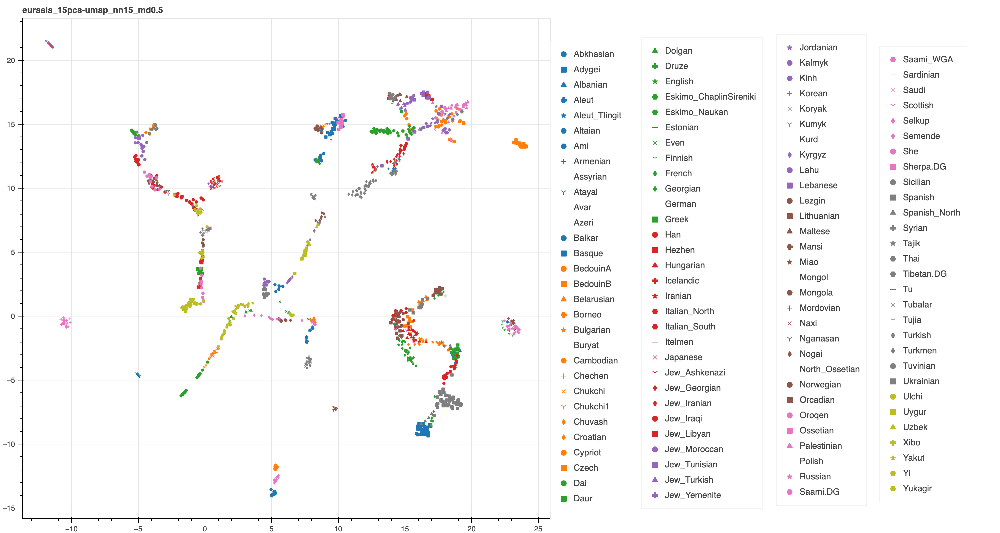

# Visualizations of Genotype Datasets

This repository contains the visualizations of 1000 Genomes dataset ([1000 Genomes Project Consortium](https://www.ncbi.nlm.nih.gov/pmc/articles/PMC3498066/)) and the modern Eurasian population dataset ([Lamnidis et al.](https://www.nature.com/articles/s41467-018-07483-5)). The dimensional reduction techniques used include PCA, t-SNE, UMAP, and Adversarial Autoencoders ([Makhzani et al.](https://arxiv.org/pdf/1511.05644.pdf))

All visualizations can be founded in the form of interactive htmls in the `htmls` folder. The interactive htmls let you pan, zoom, hover on data points, and also hide data of particular labels by clicking on the legend. 

We also hand pick some visualizations and display them as static images below.

## 1000 Genomes

For reference, [Diaz-Papkovich et al.](https://journals.plos.org/plosgenetics/article?id=10.1371/journal.pgen.1008432) have applied PCA, t-SNE, and UMAP to the 1000 Genomes dataset. The following figure is the first figure in the paper

**A** corresponds to PCA outputs. **B** corresponds to t-SNE outputs. **C** corresponds to UMAP outputs. **D** correponds to the outputs of first applying PCA to reduce the dimension down to 15 and then applying UMAP

Our results are below:

- PCA

- t-SNE

- UMAP

- UMAP on 15 PCs

- Vanilla Adversarial Autoencoders

- Adversarial Autoencoders with Cluster Heads

We haven't managed to exactly reproduce the results from Diaz-Papkovich et al; we're working on it. 

And feel free to explore the visualizations further using the interactive htmls that can be founded in the `htmls` folder

## Modern Eurasian population

For reference, [Lamnidis et al.](https://www.nature.com/articles/s41467-018-07483-5) have applied PCA to this dataset:

Our results are below:

- PCA

- t-SNE

- UMAP

- UMAP on 15 PCs

- Vanilla Adversarial Autoencoders

- Adversarial Autoencoders with Cluster Heads

